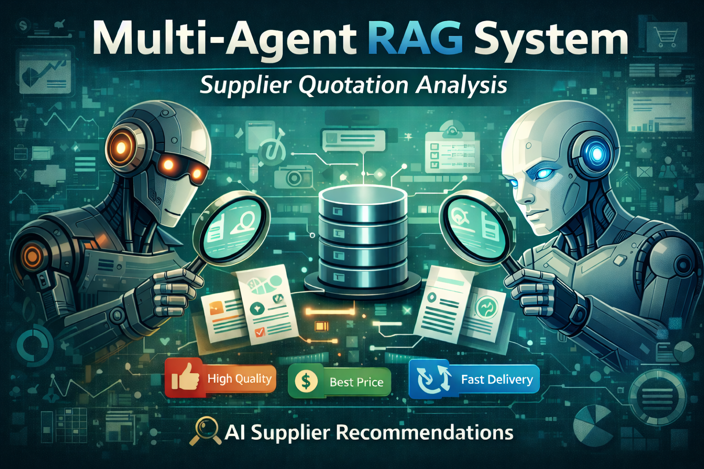

<p align="center">
  
</p>

# Multi-Agent RAG System for Supplier Quotation Analysis

## Overview
This project implements a Multi-Agent Retrieval-Augmented Generation (RAG) system designed to automatically analyze supplier quotations written in natural language and recommend the best supplier based on structured commercial criteria.

The system processes unstructured quotation text, extracts structured offer data, stores it in a vector database, and allows users to submit natural-language queries with constraints. Supplier recommendations are generated exclusively from retrieved data, ensuring grounded, explainable, and non-hallucinatory results.

This project was developed as a technical take-home assignment with a strong emphasis on clarity, reproducibility, clean architecture, and explainable decision-making.

---

## System Architecture
The system is implemented as a modular, API-driven architecture built around a Retrieval-Augmented Generation (RAG) pipeline.

At a high level, the application is a FastAPI service exposing endpoints for quotation ingestion and supplier querying. Supplier quotations are submitted as raw text and processed through a pipeline that combines information extraction, semantic retrieval, and weighted evaluation.

Structured offers are embedded and stored in a vector database (Chroma), enabling semantic similarity search at query time. During evaluation, only retrieved offers are considered, ensuring that all recommendations and explanations are strictly grounded in the available data.

The application is containerized using Docker and orchestrated via Docker Compose, allowing the full system to be executed consistently across environments for reliable testing and evaluation.

---

## Project Structure
The project follows a clean and explicit directory structure that separates API layers, agents, services, models, and storage components.
```
app/
├── __init__.py
├── main.py
├── agents/
│   ├── __init__.py
│   ├── evaluator_agent.py
│   ├── extractor_agent.py
│   ├── product_match_agent.py
│   └── retriever_agent.py
├── api/
│   ├── query_api.py
│   └── upload_api.py
├── models/
│   ├── __init__.py
│   └── offer.py
├── services/
│   ├── __init__.py
│   ├── embeddings.py
│   ├── llm_service.py
│   ├── query_parsing.py
│   └── vector_store.py
└── storage/
    ├── __init__.py
    └── offer_store.py

.chroma/ 

docs/                 
└── runbook.md

tests/
├── test_llm.py
├── test_pipeline.py
├── test_product_match.py
└── test_query_parsing.py

.env
.gitignore
docker-compose.yml
Dockerfile
pytest.ini
README.md
requirements.txt

```

---

## Agent Architecture
The intelligent core of the system is implemented using four cooperating agents, each with a clearly defined responsibility.

The ExtractorAgent processes raw supplier quotation text and converts unstructured information into structured commercial offers. It extracts supplier names, item descriptions, unit prices, delivery times, payment terms, and optional internal notes. A hybrid approach combining rule-based extraction and an LLM fallback is used to improve robustness.

The RetrieverAgent stores structured offers as vector embeddings in the Chroma vector database and retrieves the most relevant offers based on semantic similarity to the user query. This step ensures that only contextually relevant quotations are evaluated.

The EvaluatorAgent scores and ranks retrieved offers using weighted criteria such as price, delivery time, and risk assumptions. In addition, it generates a concise, grounded natural-language explanation that summarizes the decision-making process and highlights relevant trade-offs between competing offers. This explanation is returned to the user as the reasoning field in the API response.

In addition, the system includes a ProductMatchAgent, which enforces a hard business rule ensuring that the product requested by the user matches the product offered by suppliers.

After semantic retrieval, each candidate offer is validated against the target product extracted from the user query using embedding similarity. Offers that do not meet the similarity threshold are rejected before evaluation. This prevents semantically related but incorrect products from being ranked or selected.

---

## How the System Works
1. Supplier quotations are uploaded as plain text.
2. The ExtractorAgent converts unstructured text into structured offers.
3. Structured offers are embedded and stored in the vector database.
4. The user submits a natural-language query with constraints.
5. Relevant offers are retrieved using semantic similarity search.
6. Retrieved offers are filtered by a product-level business rule to ensure product correctness.
7. The EvaluatorAgent ranks valid offers and generates a reasoned recommendation.


---

## Running the Application

### Option 1: Run with Docker (Recommended)
Build and start the application using Docker Compose:

docker compose up --build

Once running, the API is available at:

http://localhost:8000

Interactive API documentation (Swagger UI):

http://localhost:8000/docs

To stop the application:

docker compose down

---

### Option 2: Run Locally (Without Docker)
Create and activate a virtual environment:

python -m venv .venv
source .venv/bin/activate

Install dependencies:

pip install -r requirements.txt

Start the FastAPI server:

python -m uvicorn app.main:app --reload

Access the API documentation:

http://127.0.0.1:8000/docs

---
For a complete list of execution commands, test commands, Docker usage, and troubleshooting steps, see:

**[docs/runbook.md](docs/runbook.md)**

---

## Using the API

### Step 1: Upload Supplier Quotations
Use the /upload endpoint to ingest supplier quotations.

Endpoint:
POST /upload

Example request body:
```
{
  "texts": [
    "Supplier QuickFix Ltd offers 10mm steel bolts at €0.75 per unit. Delivery in 10 days. Payment terms Net 45.",
    "EuroBuild Components can supply steel bolts for €0.78 each with delivery in 12 days. Payment terms Net 60.",
    "FastSupply Co offers bolts at €0.95 per unit with express delivery in 5 days. Payment terms Net 15."
  ]
}
```
Behavior:
Each upload resets the vector store to ensure deterministic evaluation and prevent duplicated offers.

---

### Step 2: Query for the Best Supplier
After uploading quotations, use the /query endpoint to retrieve and evaluate the best supplier.

Endpoint:
POST /query

Example request body:
```
{
  "query": "Find the best supplier for 10mm steel bolts deliverable within 7 days"
}
```
Example response structure:
```
{
  "best_offer": { ... },
  "ranking": [ ... },
  "reasoning": "...",
  "target_item": "...",
  "product_match": {
    "threshold": 0.7,
    "kept": 1,
    "rejected": 2,
    "logs": [ ... ]
  }
}
```
The response includes the recommended supplier, a full ranking of evaluated offers, and a grounded explanation describing the trade-offs considered during the decision-making process.

---

## Design Decisions
The vector database is reset on each upload to avoid duplicated offers and ensure deterministic behavior during evaluation. Delivery time is treated as a soft constraint unless explicitly specified as mandatory. All reasoning is strictly grounded on retrieved offers, preventing hallucinated prices, delivery times, or risk information.
A dedicated product-matching step is applied after retrieval to ensure that only offers corresponding to the user-requested product are evaluated.

---

## Limitations and Future Improvements
The system does not maintain a persistent multi-batch quotation history by design. Risk assessment relies solely on information explicitly present in quotation text. Potential future improvements include persistent vector storage, hard delivery constraints, supplier reputation scoring, and authenticated user-specific quotation histories.

---

## Tech Stack
Python 3.11  
FastAPI  
Chroma Vector Database  
Sentence-Transformers  
OpenAI-compatible LLM interface  
Docker and Docker Compose  

---

## Author
Developed by Diego Santos as part of a technical assessment exploring multi-agent RAG architectures, semantic retrieval, and business rule validation.
